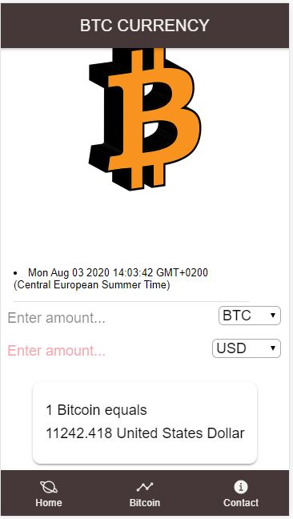
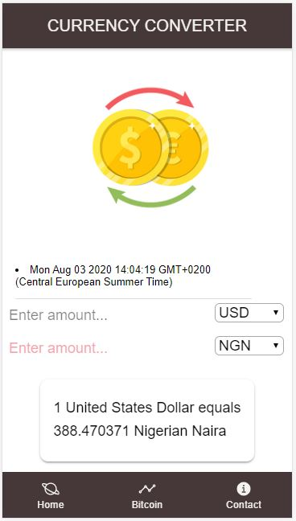
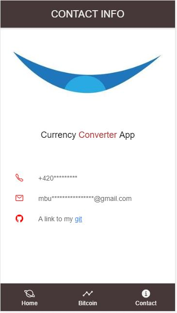

# Currency Converter App with Ionic framework 5 and Angular 9

## 🚀 General Information

# Sample Outputs
 

  

   

# Requirements
Node 10+
Npm 6+
Ionic 5+
Ionic Lab 1+
brew update && brew upgrade
$ install node
$ npm install -g npm@latest
$ npm install -g ionic@rc
$ npm install -g @ionic/lab@rc sever
Created with Ionic CLI version 5.0.0 RC:
ionic start i4demo blank --type=angular --cordova

# Build 
$ ionic build
$ ionic serve

# Key Notes
Data binding
Event binding
HTTPClient
JSON Mapping
Asynchronous method

# Contact
Repo created by <a href="https://github.com/Mbboutidem">Mbuotidem</a>